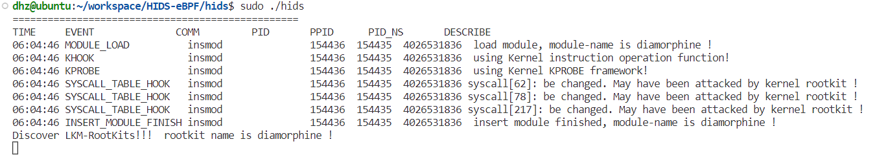
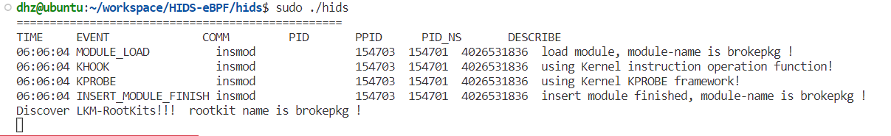

# eBPF-HIDS

```shell
# source code
./hids/hids.bpf.c  
./hids/hids.c  
./hids/hids.h 
./hids/com_funaddr.c 
```

# usage

```shell
cd hids 
# Compile
make hids   # 或者 make all  
# 运行hids
sudo ./hids
```

# Rootkit-Examples

## Diamophine Rootkit
```shell
# https://github.com/m0nad/Diamorphine
# 直接修改系统调用表，实现对系统调用的劫持

# Install
cd Diamorphine          # Enter the folder
make                    # Compile
insmod diamorphine.ko   # Load the module(as root)

# Uninstall
kill -63 0          # The module starts invisible, to remove you need to make it visible
rmmod diamorphine   # Then remove the module(as root)
```

    

## brokepkg Rootkit
```shell
# https://github.com/R3tr074/brokepkg
# 基于ftrace framework实现对系统调用及内核函数的劫持

# Install
cd brokepkg             # Enter the folder
make config             # Configuration
make install            # Compile
insmod brokepkg.ko      # Load the module(as root)

# Uninstall
kill -31 0  # Remove brokepkg invisibility to uninstall him
sudo rmmod brokepkg  # Then remove the module
```

    


# todo
Complete documentation... 
