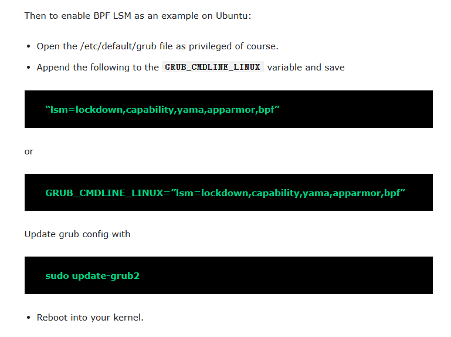

## LSM相关

#### 环境配置（两种方式判断）

（这部分问题是bpftrace的hook点写错）

使用lsmtrace.c脚本查看序列，执行security_xxx但未真实进入 lsm/XXX ，原因CONFIG_LSM = "无bpf"

查看配置

`grep CONFIG_LSM /boot/config-$(uname -r)`

配置lsm但未生效，很奇怪

```
GRUB_CMDLINE_LINUX="lsm=lockdown,capability,yama,apparmor,bpf"
vim /etc/default/grub
sudo update-grub2
最后重启电脑
```

所需配置

```
CONFIG_DEBUG_INFO_BTF=y
CONFIG_BPF_LSM=y //单独这一项开启也ok
CONFIG_LSM="[other LSMs],bpf"
```



参考的环境配置方法

https://kalilinuxtutorials.com/bpflock/

https://github.com/linux-lock/bpflock

https://github.com/JeongyoonMoon/lsmbpf_demo

#### 查看LSM-hook点

[lsm_hooks.h - include/linux/lsm_hooks.h - Linux source code (v5.15) - Bootlin](https://elixir.bootlin.com/linux/v5.15/source/include/linux/lsm_hooks.h#L1609)

与lsm的hook点与 `security_xxx`函数 基本都是相对应的

```
三者对应
bpftarce的hook点为 kprobe:bpf_lsm*
security_kernel_read_file()
SEC("lsm/kernel_read_file")
```

注意部分lsm hook点没办法阻断操作的原因是时间问题，真正的操作已经在之前完成了。

[本人转载的KRSI相关视频](https://www.bilibili.com/video/BV1DT411a7gC/?vd_source=75cdae07fbd6cf57449b0984548aa6b3)

[Linux LSM(Linux Security Modules) Hook Technology - 郑瀚Andrew - 博客园 (cnblogs.com)](https://www.cnblogs.com/LittleHann/p/4134939.html#:~:text=LSM%20%28Linux%20Security,Modules%29%3A%20Linux%E6%8F%90%E4%BE%9B%E7%9A%84%E5%8E%9F%E7%94%9F%E7%9A%84Hook%E6%A1%86%E6%9E%B6%EF%BC%8C%E6%9C%AC%E8%B4%A8%E4%B8%8A%E6%9D%A5%E8%AF%B4%EF%BC%8CLSM%E6%98%AF%E7%9B%B4%E6%8E%A5%E4%B8%B2%E8%A1%8C%E7%9A%84%E6%8F%92%E5%85%A5%E5%88%B0%E4%BA%86Linux%20Kernel%E7%9A%84%E4%BB%A3%E7%A0%81%E8%B7%AF%E5%BE%84%E4%B8%AD%EF%BC%8C%E6%98%AFLinux%E6%9C%AC%E8%BA%AB%E5%AF%B9%E5%A4%96%E6%8F%90%E4%BE%9B%E4%BA%86%E4%B8%80%E5%A5%97%E5%AE%A1%E8%AE%A1%E6%9C%BA%E5%88%B6%20%28Hook%E6%A1%86%E6%9E%B6%29)