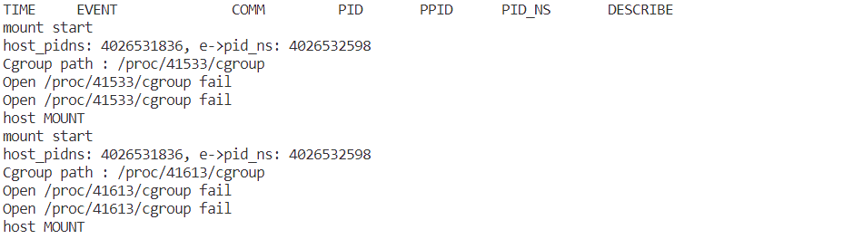

# 区分进程是否运行在容器中

参考：

[Runtime metrics | Docker Documentation](https://docs.docker.com/config/containers/runmetrics/#tips-for-high-performance-metric-collection)

[基于eBPF的应用可观测技术实践_哔哩哔哩_bilibili](https://www.bilibili.com/video/BV1ki4y1S7xW?p=4&vd_source=75cdae07fbd6cf57449b0984548aa6b3)

runc:[2:INIT] 运行在主机的根目录Cgroup中，是运行在主机侧的与docker容器同capabilities的进程

### **如何区分出容器？**

一开始粗暴的使用PID-namespace进行区分，但这是不那么合理的。简单环境下没啥问题，但复杂环境下并不能达到区分的目的

eg ：使用 `unshare -p -f --mount-proc /bin/bash `创建一个新的PID-ns并在里面运行shell，则所以的操作都会被误认为是容器的操作


进一步与Cgroups控制组进行一一对应，容器与Cgroups控制组目录（目录名：CONTAINER-ID 容器ID）绑定，目前仅针对cgroup v1

由进程ID判断是否为Docker中的进程：

* `/proc/$(PID)/cgroup `：由进程对应Cgroup在 `/sys/fs/cgroup/$(SUB-SYSTEM)/ `目录下的相对路径，docker对应的Cgroup会在/sys/fs/cgroup/cpu/docker/$(CONTAINER-ID)
* `/proc/$(PID)/comdline `：进程启动的命令

内核态一开始并不知道当前PID是否为某个容器，需要到用户态去判断当前进程PID是否为容器进程，用户态程序再通过map去告知内核态ebpf程序。如何解决这个时间差？

* 维护容器PID黑名单map（保存不是容器进程的PID   ---  ？进程exit删除对应map？），若未在黑名单中找到PID则当作容器PID处理，将event信息通过ringbuf发到用户态
* 用户态基于Cgroup判断当前容器是否为容器中的进程，若不为容器进程则将其加入黑名单map
* 之后再碰到这个PID时，内核态程序通过黑名单map即可知道其PID对应进程不在容器中运行
* 此外，最好在用户程序中维护PID到CONTAINER-ID 容器ID的关系

最佳办法：

PID-NS与Cgroup共同判断。

1. PID-ns初步判断是否需要将进程相关的事件数据发送到用户态 -   第一筛，之后都进入map中
2. 进一步通过通过容器判断PID map（保存不是容器进程的PID   ---  ），判断是否将进程相关的事件数据发送到用户态（map找不到 || 确定运行容器中 则发送事件数据）
3. 用户态程序根据进程ID判断是否为Docker中的进程，并把判断结果写入容器判断PID map中。都写入map，在进程退出时删除map中的对应元素。

进程退出时 ？进程exit删除对应map ？

PID map结构

key ：PID

value： struct

元素：是否运行在容器中、capability、容器-ID、cgroup ID？、

第一步，先全部在用户态判断是否为容器进程

### 问题：

在事件发时（eg. mount 发生时）才将进程相关数据提取并发送到用户态，有可能在用户态判断进程是否允许在容器时，进程已经退出。导致无法读取到 /proc/$(PID) 下的文件



解决方法：可在进程exec执行时收集信息，直接判断？ 然后存储到用户空间的map中

试试用C++使用 libbpf

### 测试

运行docker，在里面运行top

```
docker run -it --rm ubuntu:20.04
top
```

在主机侧用ps -aux | grep top 即可查看到容器中运行的进程


```
ps -aux | grep top
# 查看进程相关Cgroup 主机中运行的进程一般直接在cgroup的根目录中
cat /proc/$(PID)/cgroup
# 查看cpu子系统下容器相关的Cgroup
ls /sys/fs/cgroup/cpu/docker/
# 查看Cgroup中的进程就在控制组中
cat /sys/fs/cgroup/cpu/docker/$(CONTAINER-ID)/tasks
```
