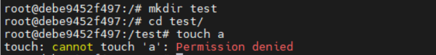

## apparmor

[AppArmor security profiles for Docker | Docker Documentation](https://docs.docker.com/engine/security/apparmor/)

[容器系统强化之AppArmor - 知乎 (zhihu.com)](https://zhuanlan.zhihu.com/p/461500815)

配置文件内容

```
// file-name : apparmor_parser 
#include <tunables/global>

profile my-config flags=(attach_disconnected,mediate_deleted) {
  #include <abstractions/base>

  network inet tcp,
  network inet udp,
  network inet icmp,

  deny network raw,

  deny network packet,

  file,
  umount,
  deny /test/** wl,       //不允许对/test/目录下文件进行写或者链接操作
}

```

将上述配置文件加载到

`sudo apparmor_parser -r -W ./apparmor_config`

在my-config配置下运行运行容器

`sudo docker run --rm -it --security-opt apparmor=my-config ubuntu:20.04`

效果如下： 

无法在/test/目录下进行任何写想过操作



## seccomp

[AppArmor security profiles for Docker | Docker Documentation](https://docs.docker.com/engine/security/apparmor/)


默认配置下运行docker

```
docker run --rm -it --security-opt seccomp=unconfined ubuntu:20.04
```


初步尝试的seccomp生效展示方法

直接编写一个ptrace的简单程序，使用docker跑这个程序

```
sudo docker run --rm --security-opt seccomp=unconfined ubuntu:20.04 ./ptrace
```

一个seccomp学习项目 [seccomp的研究demo](https://github.com/haozhuoD/seccomp_demo)


**使用seccomp资料：**

[linux 安全模块 -- seccomp 详解 - 知乎 (zhihu.com)](https://zhuanlan.zhihu.com/p/363174561)

[浅谈Linux SECCOMP安全机制在容器中的使用 - 腾讯云开发者社区-腾讯云 (tencent.com)](https://cloud.tencent.com/developer/article/1801887)

[Seccomp从0到1 - 安全客，安全资讯平台 (anquanke.com)](https://www.anquanke.com/post/id/208364)


**seccomp前沿：**

[(32条消息) LWN：非特权容器中的系统调用拦截机制！_LinuxNews搬运工的博客-CSDN博客](https://blog.csdn.net/Linux_Everything/article/details/125775482?spm=1001.2101.3001.6650.11&utm_medium=distribute.pc_relevant.none-task-blog-2%7Edefault%7EOPENSEARCH%7ERate-11-125775482-blog-117935998.t5_layer_eslanding_S_4&depth_1-utm_source=distribute.pc_relevant.none-task-blog-2%7Edefault%7EOPENSEARCH%7ERate-11-125775482-blog-117935998.t5_layer_eslanding_S_4&utm_relevant_index=12)

[(32条消息) LWN: 用eBPF实现seccomp()_LinuxNews搬运工的博客-CSDN博客](https://blog.csdn.net/Linux_Everything/article/details/117935998)


**seccomp user notification具体实现资料**

[seccomp user notification (terenceli.github.io)](https://terenceli.github.io/%E6%8A%80%E6%9C%AF/2021/05/20/seccomp-user-notify)

[Seccomp Notify | brauner’s blog](https://brauner.github.io/2020/07/23/seccomp-notify.html)

[seccomp/seccomp_user_notification.c (from &#34;The Linux Programming Interface&#34;) (man7.org)](https://man7.org/tlpi/code/online/dist/seccomp/seccomp_user_notification.c.html)
