# 目录

- [功能展示](#功能展示)
    - 容器逃逸预警
    - Rootkit检测
    - Check preload(User-mode Rootkit)
    - Nofile attack 无文件攻击
    - file_operations checks
- [内核函数级的入侵阻断](#函数级的入侵阻断)
- [内核进程级的入侵阻断](#进程级的入侵阻断)
    
# 功能展示

## 容器逃逸预警

### 高权限容器启动 

``` shell
# 容器不安全部署（配置）
# 特权容器启动
sudo docker run -it --privileged ubuntu:20.04 
# 非最小权限集容器启动，允许执行网络管理任务
sudo docker run -it --cap-add NET_ADMIN ubuntu:20.04 
```
特权容器启动时预警
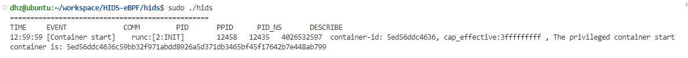    
非最小权限集容器启动时预警
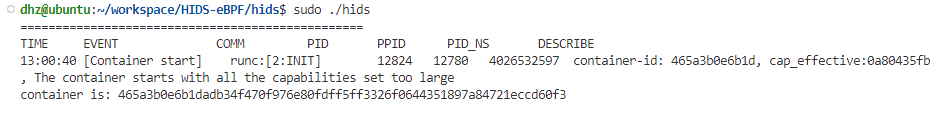    


### 容器高危目录挂载

``` shell
# 容器不安全部署（配置）
# 1. 在特权容器中将宿主机整个文件系统挂载到当前容器的目录下
# 启动特权容器 sudo docker run -it --privileged ubuntu:20.04 
# fdisk -l 查看挂载设备 /dev/sda* Type为Linux
mkdir /test && mount /dev/sda* /test

# 2. 在容器启动时通过设置参数将高危目录挂载到容器中
sudo docker run -it -v /etc:/test ubuntu:20.04
```
容器内文件系统挂载预警
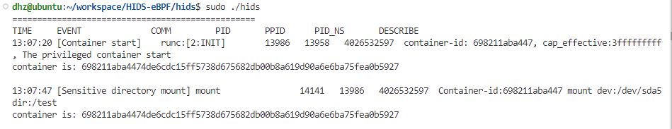  
容器启动时高危目录挂载预警
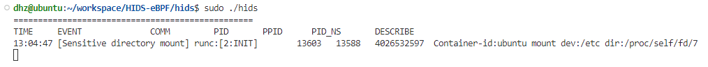  

### 容器高危文件访问（读、写）

``` shell
# 1. 在特权容器中先挂载文件系统，再访问敏感文件
# 启动特权容器 sudo docker run -it --privileged ubuntu:20.04 
# fdisk -l 查看挂载设备 /dev/sda* Type为Linux
mkdir /test && mount /dev/sda* /test
# 访问敏感文件
cat ./test/etc/ssh/sshd_config
cat ./test/etc/crontab
cat ./test/etc/shadow

# 2. 高危目录挂载到容器后，容器访问敏感文件
# 启动时挂载
sudo docker run -it -v /etc:/test ubuntu:20.04
# 访问敏感文件
cat ./test/ssh/sshd_config
cat ./test/crontab
cat ./test/shadow
```
容器高危文件访问预警
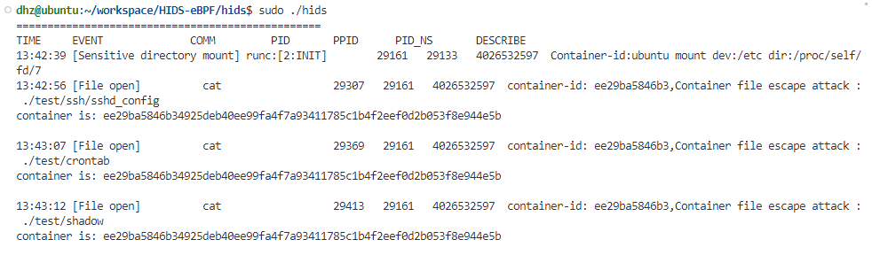  

## Rootkit检测

Some Examples: Diamophine, brokepkg...
### Diamophine Rootkit 
```shell
# https://github.com/m0nad/Diamorphine
# 直接修改系统调用表，实现对系统调用的劫持

# Install
cd Diamorphine          # Enter the folder
make                    # Compile
insmod diamorphine.ko   # Load the module(as root)

# Uninstall
kill -63 0          # The module starts invisible, to remove you need to make it visible
rmmod diamorphine   # Then remove the module(as root)
```

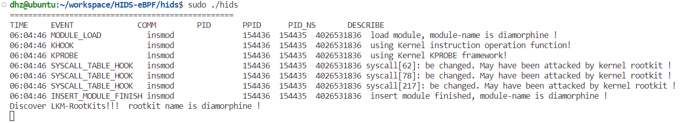    

### brokepkg Rootkit
```shell
# https://github.com/R3tr074/brokepkg
# 基于ftrace framework实现对系统调用及内核函数的劫持

# Install
cd brokepkg             # Enter the folder
make config             # Configuration
make install            # Compile
insmod brokepkg.ko      # Load the module(as root)

# Uninstall
kill -31 0  # Remove brokepkg invisibility to uninstall him
sudo rmmod brokepkg  # Then remove the module
```

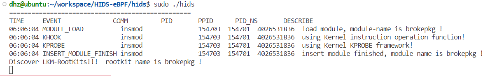    

### reveng_rtkit

```shell
# Rootkit使用说明参见：https://github.com/reveng007/reveng_rtkit
# 检测结果如下
dhz@ubuntu:~/workspace/HIDS-eBPF/hids$ sudo ./hids 
[sudo] password for dhz: 
=================================================
TIME     EVENT              COMM         PID       PPID      PID_NS       DESCRIBE
15:10:17 MODULE_LOAD          insmod               34667   34663   4026531836  load module, module-name is reveng_rtkit !
15:10:17 KHOOK                insmod               34667   34663   4026531836  using Kernel instruction operation function!
15:10:17 KPROBE               insmod               34667   34663   4026531836  using Kernel KPROBE framework!
15:10:17 SYSCALL_TABLE_HOOK   insmod               34667   34663   4026531836 syscall[0]: be changed. May have been attacked by kernel rootkit !
15:10:17 SYSCALL_TABLE_HOOK   insmod               34667   34663   4026531836 syscall[1]: be changed. May have been attacked by kernel rootkit !
......
15:10:17 SYSCALL_TABLE_HOOK   insmod               34667   34663   4026531836 syscall[334]: be changed. May have been attacked by kernel rootkit !
15:10:17 INSERT_MODULE_FINISH insmod               34667   34663   4026531836  insert module finished, module-name is reveng_rtkit ! 
Discover LKM-RootKits!!!  rootkit name is reveng_rtkit ! 
```


##  Check preload(User-mode Rootkit)

``` shell
# 发送44号信号到任意PID触发动态链接注入检测
kill -44 2100
kill -44 $(ANY PID)
```

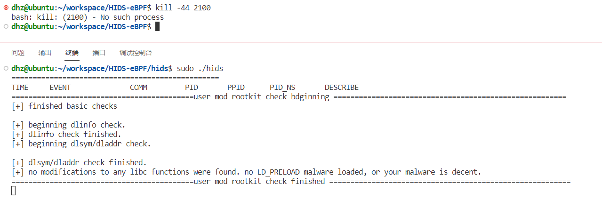  

### azazel注入攻击
``` shell
# https://github.com/chokepoint/azazel
# 动态库函数劫持实现用户态RootKit
# install
cd azazel             # Enter the folder
# 此命令可能需要运行多次
sudo make install            # 基于/etc/ld.so.preload实现劫持

# Uninstall
sudo rm -rf /lib/libselinux.so
sudo rm -rf /etc/ld.so.preload
```
动态库劫持检测信息
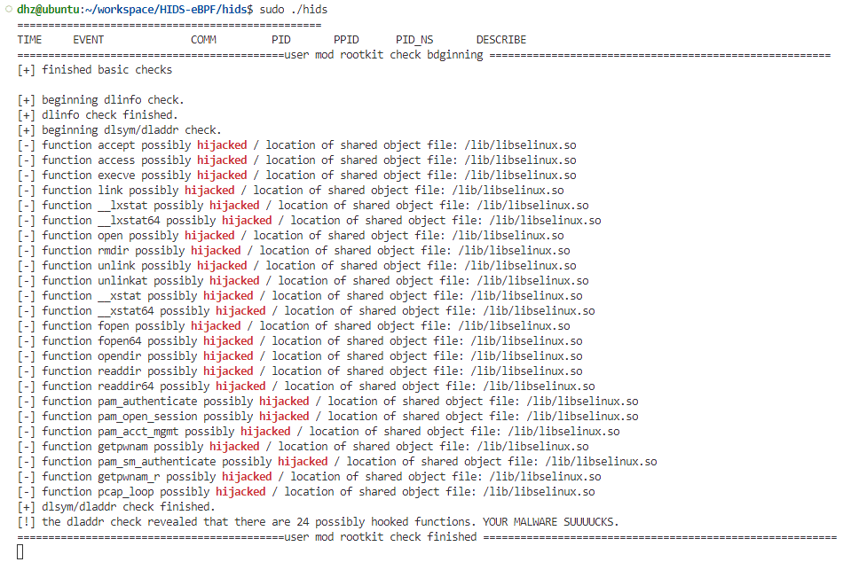 

##  Nofile attack 无文件攻击

``` shell
# no_file_attack 目录下
gcc hello.c -o date         # 生成elf可执行文件
python no_file_attack.py    # 运行脚本进行无文件攻击
```

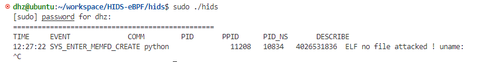  

[无文件攻击demo](./no_file_attack/no_file_attack.py)

[学习资料：linux_no_file_elf_mem_execute](https://xeldax.top/article/linux_no_file_elf_mem_execute)

##  file_operations checks

TODO：实现用户态处理、示例截图

# 函数级的入侵阻断
`lsm` 分支实现KRSI(基于LSM hook点实现函数级的入侵阻断)

以Rootkit内核模块插入为例

成功实现函数调用级的阻断，shell提示权限不够

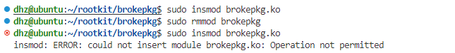 

hids提示lsm阻断，提示插入的内核模块文件名

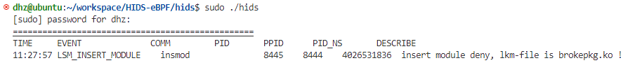

# 进程级的入侵阻断
`send_signal` 分支实现进程级的入侵阻断，基于bpf_send_signal()辅助函数发送信号实现

以Rootkit内核模块插入为例（目前阻断插桩点的选择存在问题）

成功实现进程级的入侵阻断，insmod进程被kill，shell提示Terminated

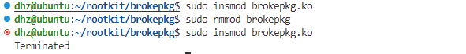

hids正常提示相关信息

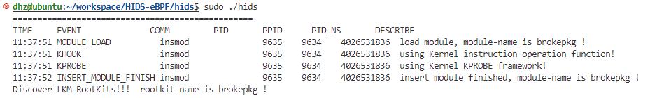

